# Tesla Charge Port Remote Control Signal

## Background
On Twitter, [@IfNotPike](https://twitter.com/IfNotPike/status/1507852693699661827) did some fantastic work capturing the Tesla charge port remote control signal and providing the I/Q data for anyone to replay it to open charge ports. Unfortunately, there is a little Easter Egg they missed when analyzing the signal...LOL, classic Tesla. I am surprised `69` appeared so few times...

I appreciate the work done by [@IfNotPike](https://twitter.com/IfNotPike), and I thoroughly enjoyed analyzing the signal myself. Also, thanks to [cemaxecuter](https://sourceforge.net/u/cemaxecuter/profile/) for all their work into a simple out-of-the-box solution for signals analysis: [DragonOS](https://sourceforge.net/projects/dragonos-lts/). I appreciate the entire OSS community, but I can't list everybody :( I hope this little guide helps motivate other folks to explore the world of reverse engineering wireless signals.

## Gather Tools
While there are many ways to reverse engineer signals, these are the tools for one approach in reverse engineering a simple signal like that for the Tesla charge port.

* The transmitter ([Tesla Charger](https://shop.tesla.com/category/charging))
* A Software Defined Radio (SDR)
  * I used a [HackRF One](https://greatscottgadgets.com/hackrf/one/), but the concepts apply to other SDRs.
* [Gqrx](https://gqrx.dk/)
  * Used to capture the signal and save the raw I/Q data to a file for later analysis. Any other software that can save the SDRs I/Q data to a file will also work. E.g., `hackrf_transfer` or `SDR#`.
* [Inspectrum](https://github.com/miek/inspectrum)
  * Used to analyze the captured signal.
* [GNU Radio](https://www.gnuradio.org/)
  * Used to synthesize a replicated signal or to replay the captured I/Q data. Ultimately replicates the Tesla charger by transmitting the same signal through an SDR.

# Capture the Signal
Start by opening up _Gqrx_ and configuring the I/O device. You shouldn't need to change anything, but you can decrease the sample rate. It usually defaults to 8,000,000, which is fine, but Gqrx kept freezing during my captures. I finally got some captures when I decreased the sample rate to 4,000,000. I don't know if that is directly part of the problem, but it seemed to be a good-enough interim solution. Apparently, [others](https://bbs.archlinux.org/viewtopic.php?id=265800) have experienced this type of problem too.

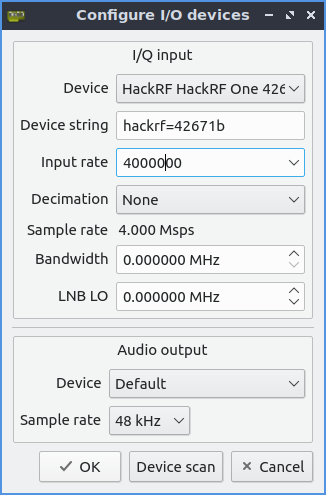

Now that we've configured the I/O device, we need to set the correct frequency. Based on the FCC ID ([2AEIM-1023049](https://fccid.io/2AEIM-1023049)) of the Tesla charge port remote, we know it operates at 315MHz. We don't want that to be our center frequency, though. We'll always get a "loud" signal at the hardware center frequency caused by DC voltage on the radio. To get past this, we'll technically listen to 500KHz (NOTE: 500KHz is arbitrary. Just pick something that offsets the signal a bit from the SDR's hardware center frequency) above or below our target 315MHz. A frequency slightly offset from 315MHz will move the "loud" signal away from the target, making it easier/possible to analyze.

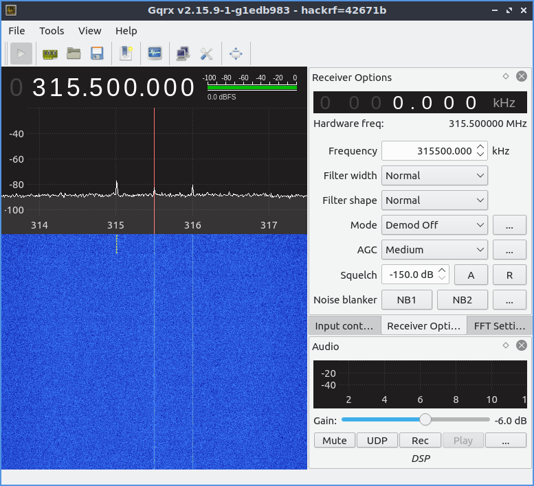

Now that we can see the signal, it's time to record it for further analysis. In _Gqrx_, we can use the _I/Q Recording Tool_ found in _Tools_ > _I/Q recorder_. A recording is simple. Select the target directory to save the file, and press the _Rec_ button to start and stop recording. You must ensure _Gqrx_ actively listens for the recorder to capture data.

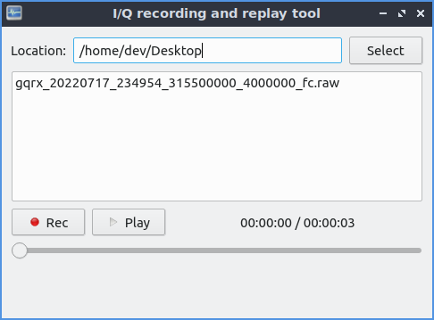

That's it for capturing the signal. If we get a nice, clean signal, we can open it up in _Inspectrum_ and see what surprises Tesla has for us.

# Analyze the Signal
We'll use Inspectrum to look at the signal we just captured. When you open the raw I/Q data captured earlier, you'll need to scroll over until you find a signal that stands out.
There may be a solid line across the spectrogram view, the DC voltage spike you get on some SDRs. If you didn't offset your hardware center frequency, your signal would show up above that solid line or below it depending on how you offset the signal.

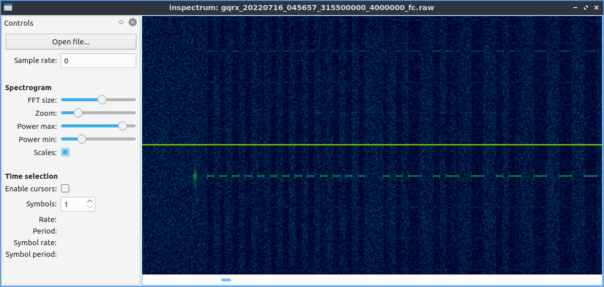

Once you find some darker-colored dashes in the plot, you have likely seen the signal of interest. _Right-click_ on the spectrogram view and select _Add derived plot_ > _Add amplitude plot_ to begin analysis. Use your mouse to drag the shaded area on the spectrogram over the signal of interest. You may also need to change the height of the shaded area only to cover a small part of the signal. Lastly, you may need to adjust the _Power max_ on the left _Controls_ panel. As you change to these variables, you'll see the peaks of the signal rise over the dashed line on the amplitude plot and see off signals stay below the dashed line. The image below shows how we want the amplitude plot to look.

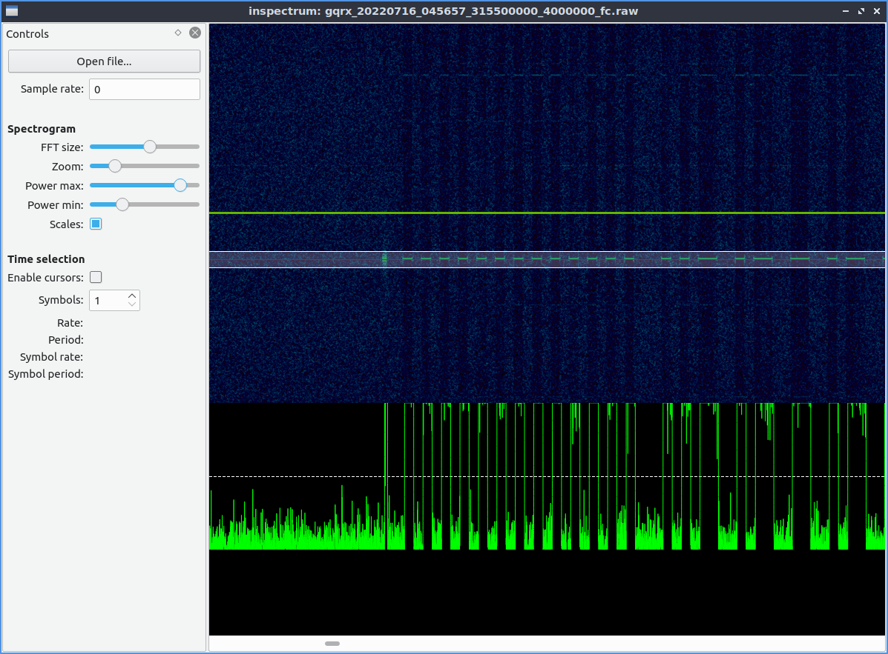

Now that we have an amplitude plot with stronger signals above that dashed line and weak noise below the dashed line, we can add a _Threshold plot_ which gives us a clean on/off signal. To add the _Threshold plot_, right-click on the amplitude plot and select _Add derived plot_ > _Add threshold plot_.

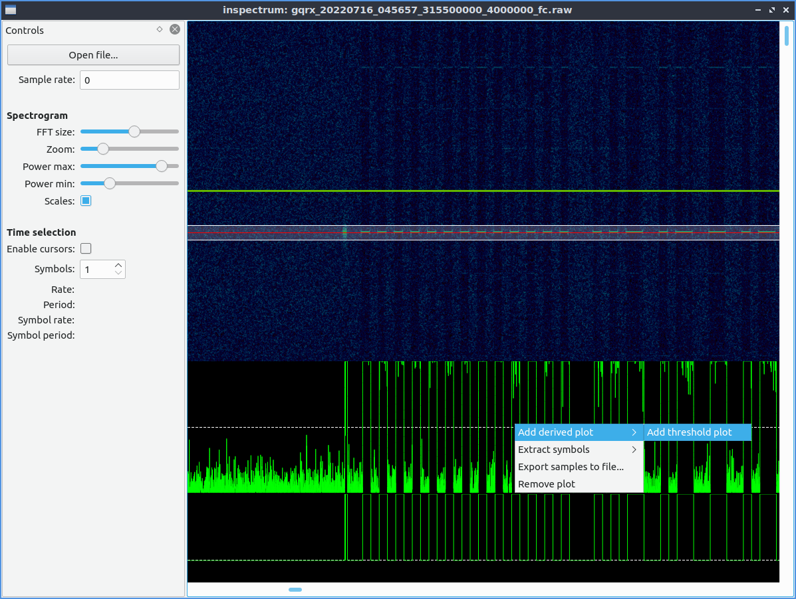

Now we have the threshold plot; we can start looking into the signal. Check _Enable cursors_ in the left _Controls_ panel of Inspectrum. You'll see a big vertical semi-transparent bar appear, and we'll use this to align with the signal and count symbols.

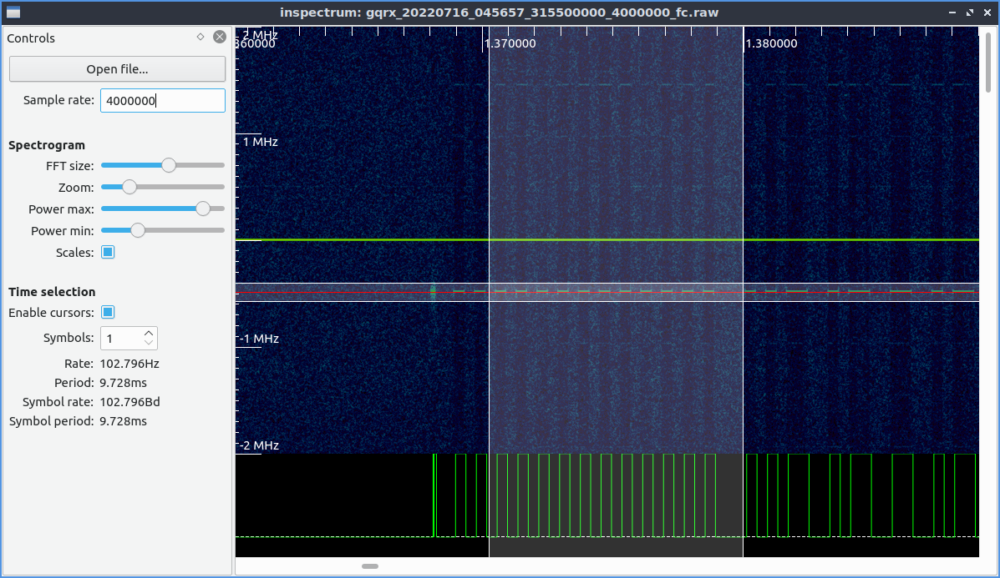

(**NOTE:** _The amplitude plot doesn't show up because I removed it, so the screen isn't so cluttered. To do so, right-click on the amplitude plot and select _Remove plot_.)

If you remember, back when capturing the signal, we specified the sample rate and how many samples per second the SDR would read and save. Now that we're looking into the characteristics of the signal, it's best to start representing everything as precisely as we can. On the left side of the _Controls_ panel, change the _Sample rate_ to match whatever you used to capture the signal. If using Gqrx the sample rate could be set to the default 8,000,000; in my case, I had to reduce it to 4,000,000 samples/second. I think I had to reduce the sample rate because I was running Gqrx in a Virtual Machine and couldn't ever get 8Msps to capture.

Now we need to align the symbols to where we think the start of the signal is, and we need to increase the number of _Symbols_ in the _Controls_ panel. In this screen grab, just to get things lined up, I set the symbol count to 25.

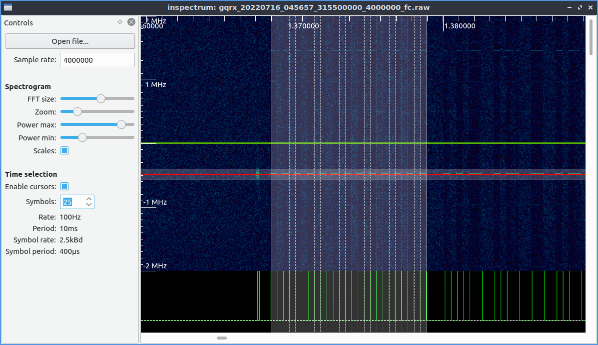

With the symbol cursors displayed over the signal, we can start adding more symbols to cover up the entire signal. I like to add a few symbols at a time and ensure all symbols continue to line up on a rise/fall of the signal and drag the right-side of the overlay as needed to ensure everything lines up. After about 3,356 symbols, we'll cover the entire charger transmission.

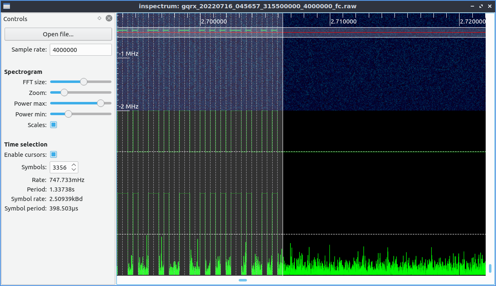

When everything lines up, we can see that the charge port remote uses a signal with the following characteristics:
* Period: about 1.3s transmit time
* Symbol rate: about 2.5 kBd
* Symbol period. about 398 microseconds

The last step of this analysis is to try to make sense of all these on/off, high/low symbols. Inspectrum helps us by automatically extracting the symbols giving us an output of 0s and 1s so we can do some higher-level analysis of the signal if needed. _Right-click_ inside of Inspectrum and select either _Export samples to file..._ or _Extract symbols_ > _Copy to clipboard_ to extract the symbols. The latter will give us a comma-separated list of 0s and 1s we can paste into notepad.

Looking at the bits in notepad, we can see what appears to be the start of a frame, some unique sequence of bits, then the actual data.

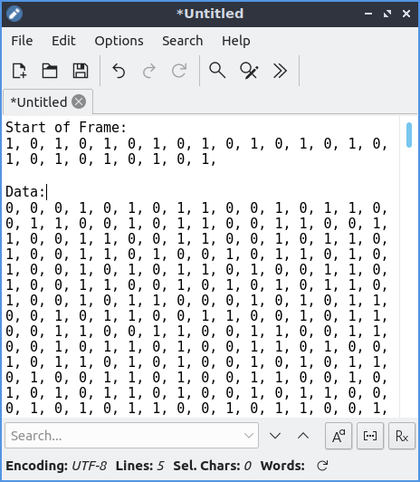

* Start of Frame
  * `0b1010101010101010101010101`
* Data
  * `0x1...`

Twitter user [@IfNotPike](https://twitter.com/IfNotPike/status/1507852693699661827) shows what appears to be the preamble and raw message. When looking at how much data there was, I wondered why the signal was so much longer than what they showed in the tweet. So I searched the text for what looked like the nice repeating start of the frame, and sure enough, it repeats ten times.

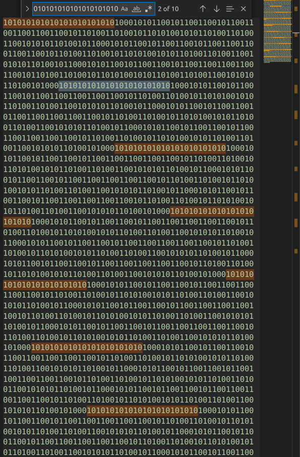

If we search the entire chunk before the preamble, we see the signal that repeats is actually 336 bits (42 bytes) (classic Tesla...) and repeats ten times for a total of 420 bytes (haha...classic Tesla)

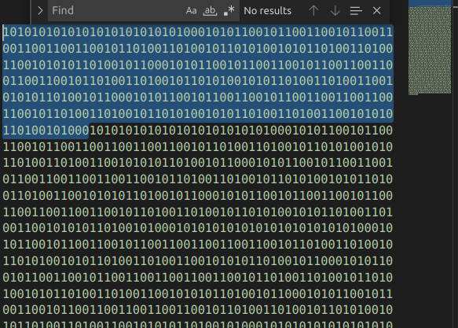

Finally, we see that the 25-bit 0s and 1s wasn't actually the preamble. The 42-byte charge port signal is `0xAAAAAA8ACB32CCCCCB4D2D4AD34CAB4B1596659999969A5A95A69956962B2CCB33332D34B52B4D32AD28`

The entire 420-byte signal is `0xAAAAAA8ACB32CCCCCB4D2D4AD34CAB4B1596659999969A5A95A69956962B2CCB33332D34B52B4D32AD28AAAAAA8ACB32CCCCCB4D2D4AD34CAB4B1596659999969A5A95A69956962B2CCB33332D34B52B4D32AD28AAAAAA8ACB32CCCCCB4D2D4AD34CAB4B1596659999969A5A95A69956962B2CCB33332D34B52B4D32AD28AAAAAA8ACB32CCCCCB4D2D4AD34CAB4B1596659999969A5A95A69956962B2CCB33332D34B52B4D32AD28AAAAAA8ACB32CCCCCB4D2D4AD34CAB4B1596659999969A5A95A69956962B2CCB33332D34B52B4D32AD28AAAAAA8ACB32CCCCCB4D2D4AD34CAB4B1596659999969A5A95A69956962B2CCB33332D34B52B4D32AD28AAAAAA8ACB32CCCCCB4D2D4AD34CAB4B1596659999969A5A95A69956962B2CCB33332D34B52B4D32AD28AAAAAA8ACB32CCCCCB4D2D4AD34CAB4B1596659999969A5A95A69956962B2CCB33332D34B52B4D32AD28AAAAAA8ACB32CCCCCB4D2D4AD34CAB4B1596659999969A5A95A69956962B2CCB33332D34B52B4D32AD28AAAAAA8ACB32CCCCCB4D2D4AD34CAB4B1596659999969A5A95A69956962B2CCB33332D34B52B4D32AD28`

# Synthesize the Signal
We already have the raw I/Q data captured from the remote, and we could simply replay that with the SDR to achieve the same effect as using the remote. Instead of merely replaying the raw signal, we will synthesize the signal from the earlier 0s and 1s we extracted from the signal.

In the src folder, I put a [GNU Radio flowgraph](src/tesla_charge_port_remote_ook_synthesizer.grc). You should be able to open the flowgraph up in GNU Radio and run it with a little bit of modification. I'm using my HackRF One, so that's how I've configured the Soapy sink block. You'll need to change the output if you're using a different SDR. Also, you may not have a Soapy sink; I think it may only be available after a certain version of GNU Radio. I don't want to turn this into all the combinations of hardware and software, but instead, point out you may need to tweak the flowgraph slightly.

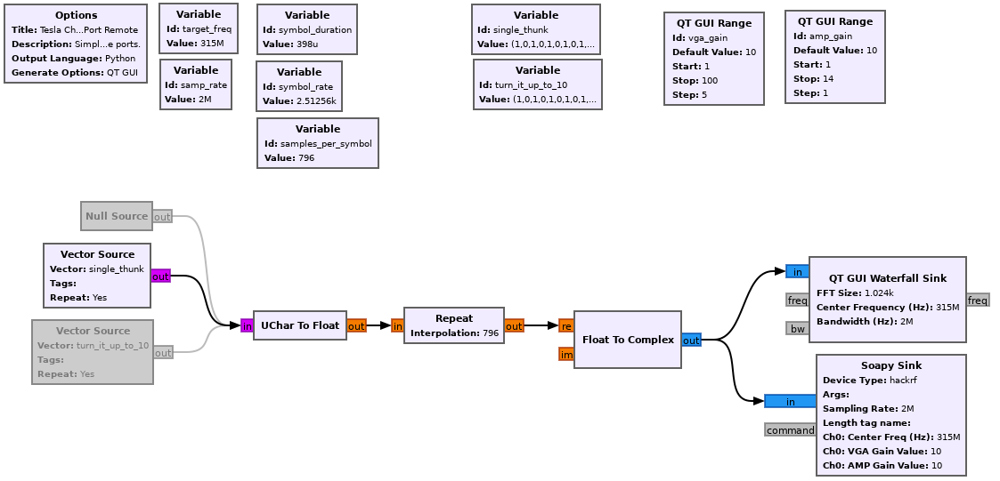
